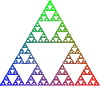

# sierpinski-triangle-rs



My modified version of Sierpinski triangle generator (chaos method) with colorful output.
The original author is https://github.com/danmack/sierpinski-rs/tree/master.
Images are saved to path "img/triangle.png"

````
cargo run

# linux
xdg-open tri.png

# macos
open tri.png
````
